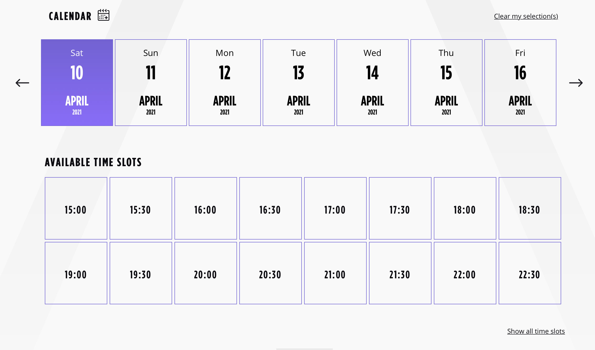

EVA.gg full stack developer recruitment test
==================================

Thank you for taking the time to do our technical test. It consists of three parts:

* [Backend coding test](#backend-coding-test)
* [Frontend coding test](#frontend-coding-test)
* [A few technical questions](#technical-questions)

In order to avoid bounced emails we would like you to submit your results by forking this repository on Github and sharing the URL of your repository with the manager from our staff. Your repository should contain :

1. a single markdown file with the answers to the technical questions
2. one folder containing the backend technical test
3. one folder containing the frontend technical test

Please add readme in the two coding folders in order to explain how to run your code.

## Backend coding test

EVA.gg provides an online booking website where players can book a game session in any of our locations. These game sessions are internally called "**slots**", and are described as a day of the week, a starting and an ending time, and a number of players.

Example of slots:

	Monday, 5pm, 5:30pm, 10 players
	Monday, 5:30pm, 6pm, 10 players

The task is to create a routine that generates all the slots of a location, based on their opening times and a number of terrains and players.

This script should read JSON file containing:

- Opening hours for each day of the week
- Number of terrains and players
- Duration of the session between the opening hours

Example:

	{
		"opening_time":{
			"monday":[{
				"from":"14:00",
				"to":"23:30"
			}],
			"tuesday":[{
				"from":"14:00",
				"to":"23:30"
			}],
			"wednesday":[{
				"from":"10:00",
				"to":"12:00"
			}, {
				"from":"14:00",
				"to":"00:00"
			}],
			"saturday":[{
				"from":"10:00",
				"to":"03:00"
			}]
		},
		"terrains":[{
			"name":"A",
			"players":12
		},{
			"name":"B",
			"players":6
		}],
		"session_duration": "00:30"
	}
	
The output of this script should be a JSON containing all the generated slots for each open day of the week, based on the opening hours and session duration. Each slot should contain:

- Day of week
- Start time
- End time
- Number of players available (add players from each terrain)

### Platform

You should create the application as a command line application using NodeJS and Typescript.

### Task requirements

Feel free to spend as much or as little time on the exercise as you like as long as the following requirements have been met.  

- Your code should compile and run in one step.
- Feel free to use whatever frameworks / libraries / packages you like.
- You **must** include tests
- Please avoid including librairies from your local build (such as node_modules folder) in your final repository

#### Acceptance criteria

- The example JSON should work with your script
- The output should be valid regarding slot's day of week, start time, end time and number of players.

## Frontend coding test

Now that we have availabilities for our locations, you will build a calendar displaying all the available slots, like the one we use publicly:

Your ReactJS app should open the file named calendar.json, and parse it to generate your frontend. This file contains 10 days of availabilites, in order to generate the exact same picker shown in the image.

### Platform

This frontend should be build with ReactJS, using [facebook/create-react-app](https://github.com/facebook/create-react-app).

### Task requirements

Feel free to spend as much or as little time on the exercise as you like as long as the following requirements have been met.  

- Your code should compile and run in one step.
- Feel free to use whatever frameworks / libraries / packages you like.
- Please try to get as close as possible as our calendar view image.

#### Acceptance criteria

- The calendar.json file should work without modifying it
- The calendar view should represents the contents of the calendar.json file

# Technical questions

Please answer the following questions in a markdown file called `Answers.md`.

1. How long did you spend on the backend coding test? What would you add to your solution if you had more time? What would've been your architecture choice for this kind of application without our example?
2. How can you handle post midnight cases to be displayed on the same day and not the next one?
3. How long did you spend on the frontend coding test? What were your biggest difficulties?
4. How would you track down a performance issue in production? Have you ever had to do this?

### Bonus questions

1. How are you feeling about our [game and locations](https://www.eva.gg)?
2. Are you a gamer? Which games do you play? 
3. Do you know livestreaming? RTMP? 

#### Thanks for your time, we look forward to hearing from you!